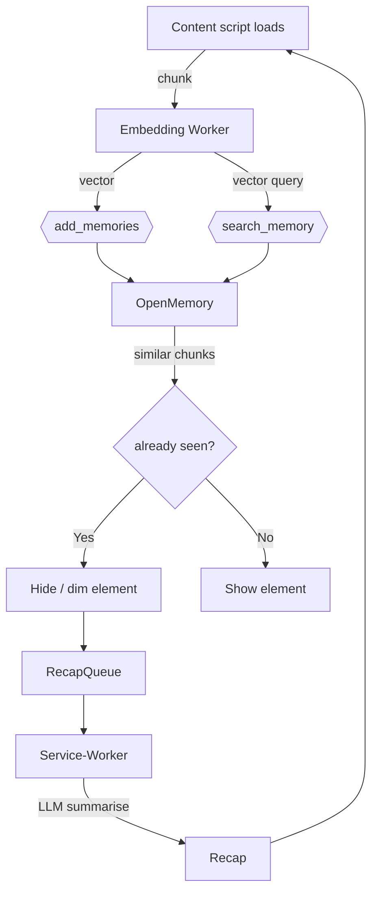

# Read Smart - Focus Mode Chrome Extension

### 1 • Why does this need to exist?

Digital learners bounce between **dozens of tabs, feeds and videos each day**. The result is cognitive overload, repeated reading of the same material, and poor consolidation. A “focus‑first” Chrome extension can act as *memory + mentor*:

| Pain today                           | Extension benefit                                                                                   |
| ------------------------------------ | --------------------------------------------------------------------------------------------------- |
| “Have I read this already?”          | Visually ghost‑out or hide paragraphs you’ve previously consumed                                    |
| Too much clutter to skim             | One‑click **Focus Mode** that leaves only novel content                                             |
| Forgetting why something was skipped | **Recap card** summarises what was removed and links back to the original source for quick revision |
| No holistic view of progress         | Cross‑site *Learning Journal* showing streaks, topics, and recall tests                             |

---

### 2 • Core user stories

1. **While browsing** an article I can click *Focus Mode* → everything I’ve already read fades or collapses.
2. I can hover a **Recap** chip to see “18 paragraphs hidden – last read on 14 May 2025 via Medium — link”.
3. I can open a **Dashboard** to review my week’s intake, spaced‑repetition reminders, and export to Notion / NeuroTrail.
4. The plugin works equally on YouTube: watched timestamps auto‑skip, and the recap shows key chapters I’ve already seen.

---

### 3 • Flow of Operation

1. **Detect the Attention Zone**
   • When the user toggles *Focus Mode*, the content script captures a **DOM snapshot** of the current viewport.
   • A lightweight heuristic (density / scroll position) *or* a Gemini / GPT‑4.1‑mini call identifies the element that most likely contains the primary reading content (e.g., `<article>`, `<main>`, or the densest `<div>`). The returned node bounds the **scope region**.

2. **Parse & Chunk Content**
   • Within the scoped region, the script splits the DOM into semantic chunks: paragraphs, headers, lists, block‑quotes, code blocks, and video chapters.
   • Each chunk receives a **stable fingerprint**—SHA‑256 of normalised text + XPath + site‑specific salt—to guard against markup drift.

3. **Match Against History**
   • For every chunk, the script performs a local **vector similarity search** (`search_memory` via MCP) against stored embeddings in IndexedDB/Qdrant.
   • Chunks whose cosine similarity exceeds **0.92** (≈ L2 < 0.5) are flagged as **already read**.

4. **Apply Focus Mode Transformations**
   • Flagged chunks are *dimmed* (opacity 0.25) or *collapsed* (display: none).
   • A **Recap component** is injected at the top—or nearest header—showing:

   1. total hidden sections,
   2. date last seen,
   3. original source link (if the earlier read was on a different URL),
   4. an optional 120‑word summary generated on‑demand via Gemini/GPT.

5. **Store Interaction & Analytics**
   • Newly seen chunks and recap metadata are persisted through `add_memories` → OpenMemory → IndexedDB (with optional Supabase sync).
   • The extension updates *streak counters, topic tags,* and *impression counts*, feeding the **Dashboard** and downstream tools such as NeuroTrail.

---

### 4 • High‑level architecture (local‑first with OpenMemory)

```
┌───────────────┐   injects    ┌────────────────────────┐
│ ServiceWorker │────────────►│  Content Script (CS)   │
│ (background)  │             │  ▸ DOM diff / chunking │
└──────┬────────┘             └─────────┬──────────────┘
       │ messaging                         │
       ▼                                   ▼
┌───────────────┐             ┌────────────────────────────┐
│ Embedding     │             │  Local Vector Store        │
│ Encoder WASM  │◄───────────►│ (Qdrant‑WASM / Chroma)     │
└──────┬────────┘   add/search│  exposed via MCP           │
       │                      │  (OpenMemory server)       │
       ▼                      └───────────┬────────────────┘
┌───────────────┐                         │
│ Learning DB   │                         │
│ (IndexedDB)   │◄─────────────persist────┘
└───────────────┘
              (optional cloud sync) ▲
                                      │
                              ┌───────┴───────┐
                              │  Supabase DB  │
                              └───────────────┘
```

*The extension ships with an **embedded OpenMemory MCP server** (Docker‑less WASM build) that exposes `add_memories`, `search_memory`, `list_memories`, and `delete_all_memories`. Chunks are stored as **vector embeddings + metadata**, enabling fuzzy recall instead of brittle hashing.*

---

### 5 • Key components & techniques (updated)

| Layer / Module                       | Responsibility                                                                                                                                                                                                    | Notes                                                                                                                               |
| ------------------------------------ | ----------------------------------------------------------------------------------------------------------------------------------------------------------------------------------------------------------------- | ----------------------------------------------------------------------------------------------------------------------------------- |
| **Content Script**                   | ① Parse DOM into logical chunks (paragraphs, code blocks, list items, video chapters) ② Call *Embedding Worker* for semantic fingerprint ③ Hide or style‑dim chunks returned by `search_memory` as *already‑seen* | Uses *MutationObserver* for dynamically loaded pages; chunk IDs are the SHA‑256 of text + structural path                           |
| **Embedding Worker (WASM)**          | Runs MiniLM‑L6 or `bge‑small‑en` model compiled to WebAssembly / WebGPU; converts each chunk into a 384‑D vector in \~10 ms.                                                                                      | Falls back to OpenAI `text-embedding-3-small` if WebGPU unavailable.                                                                |
| **OpenMemory MCP Client**            | Wraps calls to the embedded MCP endpoint (`add_memories`, `search_memory`). Handles batched upserts and hybrid retrieval (vector + keyword).                                                                      | Memory objects: `{id, vector, text_excerpt, source_url, first_seen, last_seen}`. Importance score derived from recency × attention. |
| **Local Vector Store (Qdrant‑WASM)** | Stores embeddings on‑device with HNSW index; delivers < 5 ms similarity search for 10 k chunks.                                                                                                                   | Bundled with the MCP server; storage quota enforced via aggressive vector pruning (keep top‑k per domain).                          |
| **Service‑Worker**                   | Schedules background embedding, memory consolidation (e.g. merging near‑duplicate vectors), and periodic sync to Supabase if user enables cloud backup.                                                           | Uses Chrome Alarms API for offline‑first operation.                                                                                 |
| **Dashboard UI**                     | Streaks, semantic topic clusters, spaced‑repetition queue, export buttons.                                                                                                                                        | React + Tailwind; uses MCP `list_memories` and client‑side Louvain to cluster vectors into topic communities.                       |

---

### 6 • API key management strategy (unchanged)

To ensure secure and scalable use of LLM or external embedding APIs without a backend:

1. **User‑provided API keys (default)** – stored in `chrome.storage.sync`, never leaves device.
2. **OAuth2 identity flow (optional)** – supports Google Gemini & OpenAI.
3. **Rotation & quotas** – automatic back‑off; surface warnings in UI.
4. **Fallback** – local MiniLM / bge models mean the extension remains fully offline‑capable.

---

### 7 • Algorithm sketch (mermaid, vector‑aware)



*Similarity threshold:* cosine > 0.83 (\~HNSW L2 distance < 0.6). Importance score = `decay(last_seen) × attention_weight`.

---

### 8 • Privacy & performance considerations (updated)

* **All vectors stay local** – OpenMemory runs in the browser (or optional Docker) with zero external calls unless cloud sync is toggled.
* **Compact embeddings** – 384‑D × float16 → < 1 KB per chunk; 10 k chunks ≈ 10 MB.
* **Memory pruning** – keep *N* most‑referenced vectors per domain; consolidate highly‑similar memories.
* **Lazy summarisation** – only when ≥ 1 kB hidden or user hovers Recap.

---


