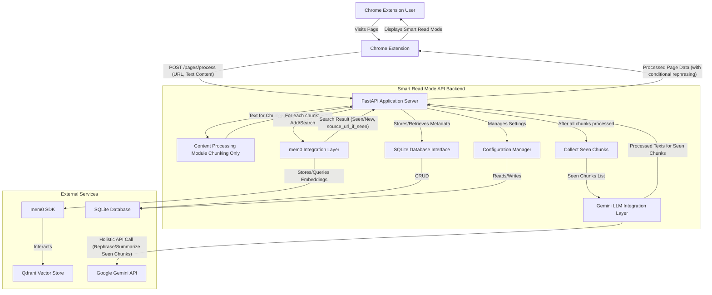
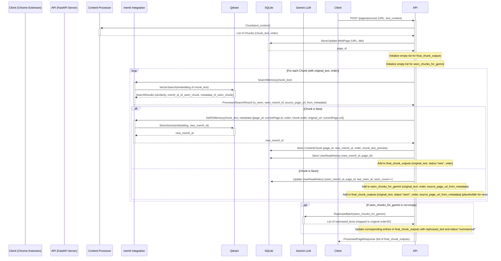

# Smart Read Mode API - MVP Technical Architecture Plan

## 1. Overview

The Smart Read Mode API is a backend service designed to support a Chrome extension that enhances web page reading by tracking user history. The primary goal is to intelligently present content by highlighting new, unseen material, collapsing or summarizing already-read sections, and providing references to previously encountered overlapping information.

This document outlines the technical architecture for an MVP (Minimum Viable Product) of this API.

**Core Functionalities:**

*   **Content Ingestion:** Receives pre-processed text content and associated URL.
*   **Chunking:** Divides the provided text into manageable chunks.
*   **Memory Storage:** Store chunks and their semantic representations (embeddings) using `mem0` SDK and Qdrant.
*   **Semantic Comparison:** Compare new content chunks against the user's reading history in memory to identify novel vs. seen content.
*   **Content Rephrasing/Summarization:** Utilize Google Gemini LLM to rephrase or summarize seen content.
*   **Structured Output:** Provide a processed version of the page indicating new, seen, summarized, and referenced content.
*   **Configuration Management:** Allow setting up and managing external service configurations (Qdrant, Gemini, `mem0`).

**High-Level Interaction Flow (Primary Use Case):**

1.  User visits a webpage via the Chrome extension.
2.  Extension sends the page URL and its pre-processed text content to the Smart Read Mode API.
3.  API receives the text and divides it into chunks.
4.  The API processes all chunks:
    *   For each chunk, it queries `mem0` (backed by Qdrant) to determine if it's "new" or "seen" by comparing against the user's memory.
    *   Information about "seen" chunks, including their original text and any retrieved `source_page_url` (where they were first encountered), is collected.
    *   "New" unique chunks are added to `mem0` with metadata including the current `page_url` and `order`.
5.  After processing all chunks, if there are "seen" chunks requiring rephrasing/summarization:
    *   The API makes a holistic call (or batched calls if necessary) to Gemini, providing the collected "seen" chunks.
    *   Gemini's response is parsed and mapped back to the respective "seen" chunks.
6.  API updates SQLite DB with page metadata, new chunk relationships, and user read state for all chunks.
7.  API returns a structured representation of the page to the extension, detailing which parts are new, read (with original text or rephrased/summarized text from Gemini), and any cross-references (`source_page_url`).

**Addressing the Memory Challenge:**
When a page has significant overlap (e.g., 80%) with previously read content, the approach will be:
*   **Store all unique chunks:** Each distinct piece of content (chunk) is stored once in the vector store (`mem0`/Qdrant) with its embedding.
*   **Link chunks to pages:** The SQLite database will maintain relationships, indicating which chunks belong to which web pages and their order.
*   **Track user read state per chunk:** SQLite will also track which chunks a user has "seen".
This ensures data de-duplication at the chunk level in the vector store, while allowing full page reconstruction and accurate novelty detection. The original full content of a page might be stored or hashed for integrity, but the primary processing relies on chunks.

## 2. Core Technologies

*   **Framework:** FastAPI (Python)
*   **Memory SDK & Vector DB Interface:** `mem0` SDK
*   **Vector Store:** Qdrant (managed via `mem0`)
*   **Relational Database:** SQLite (for metadata, user read states, configurations)
*   **LLM for Rephrasing/Summarization:** Google Gemini API
*   **Data Validation/Serialization:** Pydantic
*   **Asynchronous Operations:** Leveraging FastAPI's `async/await` capabilities.

## 3. System Architecture



**Component Descriptions:**

*   **FastAPI Application Server:** The main entry point for API requests. Receives pre-processed text and orchestrates calls to other modules and services, including conditional logic for invoking the Gemini LLM based on memory search results. Handles HTTP request/response, routing, and authentication (if any in future).
*   **Content Processing Module (Chunking Only):**
    *   Responsible for implementing a chunking strategy (e.g., sentence-based, fixed-token-size, paragraph-based) to divide the provided text content into manageable units.
*   **`mem0` Integration Layer:**
    *   Abstracts interactions with the `mem0` SDK.
    *   Handles adding new content chunks to `mem0` (which then processes them, generates embeddings, and stores them in Qdrant).
    *   Performs semantic searches via `mem0` to find chunks similar to the current ones, effectively checking against the user's memory.
*   **SQLite Database Interface:**
    *   Manages all interactions with the SQLite database.
    *   Stores metadata about web pages, content chunks (linking to `mem0` IDs), user read states, and system configurations.
*   **Gemini LLM Integration Layer:**
    *   Manages API calls to the Google Gemini LLM.
    *   Sends content chunks to Gemini for rephrasing or summarization based on API logic.
    *   Handles prompt engineering and response parsing.
*   **Configuration Manager:**
    *   Provides an interface to read and write system configurations (e.g., API keys, Qdrant connection details) stored in the SQLite database.

### 3.1. API Request Sequence Diagram (`POST /api/v1/pages/process`)



## 4. Data Model (SQLite)

For the MVP, we'll use simple SQLite tables. We'll assume a single-user context for the MVP to simplify user management, but `user_id` fields can be added for future multi-user support.

**Tables:**

1.  **`WebPages`**
    *   `id`: INTEGER PRIMARY KEY AUTOINCREMENT
    *   `url`: TEXT UNIQUE NOT NULL (URL of the page)
    *   `title`: TEXT (Title of the page)
    *   `processed_at`: TIMESTAMP DEFAULT CURRENT_TIMESTAMP (When the page was last processed by the API)
    *   `content_hash`: TEXT (A hash of the raw main content to detect changes, optional for MVP)

2.  **`ContentChunks`**
    *   `id`: INTEGER PRIMARY KEY AUTOINCREMENT
    *   `page_id`: INTEGER (FK to `WebPages.id`)
    *   `mem0_id`: TEXT UNIQUE NOT NULL (Identifier for the chunk in `mem0`/Qdrant)
    *   `chunk_text_preview`: TEXT (A short preview or hash of the chunk text for easier debugging, actual text in `mem0`)
    *   `order_in_page`: INTEGER (Sequence of this chunk within its original page)
    *   `created_at`: TIMESTAMP DEFAULT CURRENT_TIMESTAMP

3.  **`UserReadHistory`** (Tracks which *unique `mem0` chunks* the user has encountered)
    *   `id`: INTEGER PRIMARY KEY AUTOINCREMENT
    *   `mem0_chunk_id`: TEXT NOT NULL (FK to `ContentChunks.mem0_id` conceptually, but directly references the unique ID in `mem0`)
    *   `first_seen_on_page_id`: INTEGER (FK to `WebPages.id`, the page where this chunk was first encountered by the user)
    *   `first_seen_at`: TIMESTAMP DEFAULT CURRENT_TIMESTAMP
    *   `last_seen_on_page_id`: INTEGER (FK to `WebPages.id`, the most recent page where this chunk was encountered)
    *   `last_seen_at`: TIMESTAMP
    *   `seen_count`: INTEGER DEFAULT 1

4.  **`Configurations`**
    *   `key`: TEXT PRIMARY KEY (e.g., "QDRANT_URL", "GEMINI_API_KEY", "MEM0_API_KEY")
    *   `value`: TEXT (The configuration value)
    *   `updated_at`: TIMESTAMP DEFAULT CURRENT_TIMESTAMP

**Relationships:**

*   `WebPages` 1 : N `ContentChunks` (A page is composed of many chunks)
*   `UserReadHistory` tracks unique `mem0_id`s. When processing a page, its chunks' `mem0_id`s are checked against this table.

## 5. API Design (FastAPI)

**General Principles:**

*   RESTful endpoints.
*   JSON for request and response bodies.
*   Pydantic models for data validation and serialization.
*   Asynchronous endpoints (`async def`).

**Pydantic Schemas (Examples in `schemas.py`):**

```python
# schemas.py
from pydantic import BaseModel, HttpUrl
from typing import List, Optional, Dict, Any

class PageProcessRequest(BaseModel):
    url: HttpUrl
    text_content: str # Pre-processed text content of the page

class ChunkOutput(BaseModel):
    original_text: str
    status: str # "new", "seen", "summarized"
    processed_text: Optional[str] = None # Summarized/rephrased text
    source_page_url: Optional[HttpUrl] = None # URL of page where this chunk was previously seen
    order: int

class PageProcessResponse(BaseModel):
    page_url: HttpUrl
    page_title: Optional[str]
    chunks: List[ChunkOutput]
    # errors: Optional[List[str]] = None # For reporting issues

class ConfigItem(BaseModel):
    key: str
    value: str

class ConfigUpdateRequest(BaseModel):
    configs: List[ConfigItem]
```

**Endpoints:**

1.  **Process a Webpage**
    *   **Endpoint:** `POST /api/v1/pages/process`
    *   **Request Body:** `PageProcessRequest`
    *   **Response Body:** `PageProcessResponse`
    *   **Functionality:**
        1.  Accepts a URL and the pre-processed `text_content` of the page.
        2.  Stores/updates page metadata (`WebPages` table) in SQLite, getting a `page_id`.
        3.  Divides the `text_content` into ordered chunks using the Content Processing Module.
        4.  Initializes an empty list for `final_chunk_outputs` and `seen_chunks_for_gemini_processing`.
        5.  Iterates through each chunk:
            a.  Queries `mem0` (via Memory Service) to check if a similar chunk exists in the user's memory. The search result from `mem0` should include metadata of the found chunk, such as its original URL (`source_page_url`).
            b.  If the chunk is "new":
                i.  Adds the chunk to `mem0` with metadata including the current `page_id`, `order`, and current page `url`.
                ii. Records it in `ContentChunks` (linking to current `page_id`, `mem0_id`, `order`) and `UserReadHistory` in SQLite.
                iii. Adds the chunk to `final_chunk_outputs` with status "new".
            c.  If the chunk is "seen":
                i.  Updates `UserReadHistory` (last_seen_at, seen_count) in SQLite.
                ii. Adds the chunk's original text, its order, and the retrieved `source_page_url` to `seen_chunks_for_gemini_processing`.
                iii. Adds a placeholder for this chunk to `final_chunk_outputs` (status "seen", with original text and `source_page_url`).
        6.  After iterating through all chunks, if `seen_chunks_for_gemini_processing` is not empty:
            a.  Sends the collected "seen" chunks to Gemini (via LLM Service) in a single holistic request (or batched if necessary). The request should be structured to allow Gemini to provide rephrased/summarized content for each input chunk.
            b.  Parses Gemini's response.
            c.  Updates the corresponding placeholders in `final_chunk_outputs` with the rephrased/summarized text from Gemini and changes their status to "summarized".
        7.  Constructs and returns the `PageProcessResponse` using `final_chunk_outputs`.

2.  **Get Configurations**
    *   **Endpoint:** `GET /api/v1/config/`
    *   **Response Body:** `List[ConfigItem]`
    *   **Functionality:** Retrieves all current system configurations.

3.  **Update Configurations**
    *   **Endpoint:** `PUT /api/v1/config/`
    *   **Request Body:** `ConfigUpdateRequest`
    *   **Response Body:** `List[ConfigItem]` (updated configurations)
    *   **Functionality:** Updates or adds new configuration items. Sensitive keys might require masking in response.

## 6. Core Functionalities & Logic Details

### 6.1. Content Ingestion and Chunking
*   **Direct Text Input:** The API receives pre-processed text content directly from the client (e.g., Chrome extension) along with the source URL. No server-side HTML fetching or parsing is performed by this API.
*   **Chunking Strategy:**
    *   The `Content Processing Module` is responsible for dividing the provided text into meaningful chunks.
    *   Strategies can include:
        *   Semantic chunking (e.g., by paragraphs or logical sections identified by newline characters or other delimiters in the input text).
        *   Fixed-size chunking (e.g., by a certain number of sentences or tokens) if semantic units are too large for embedding models or LLM context windows.
    *   The order of chunks as they appeared in the original text must be maintained.

### 6.2. Memory Interaction (`mem0` & Qdrant)
*   **Initialization:** The `mem0` client will be initialized with Qdrant connection details (host, port, collection name) and any necessary API keys for `mem0` itself or underlying embedding models if configured through `mem0`.
*   **Adding Chunks (Metadata for Referencing):** When a new, unique chunk is identified, use `mem0.add(text=chunk_text, metadata={'original_url': current_page_url, 'page_id': current_page_id, 'order_in_page': chunk_order})`. This `original_url` is crucial for providing references later. `mem0` handles embedding generation and storage in Qdrant. The ID returned by `mem0` is stored as `ContentChunks.mem0_id`.
*   **Semantic Search/Comparison (Retrieving Reference URL):** For each incoming chunk from a new page, use `mem0.search(query=current_chunk_text, limit=1)`.
    *   Analyze the similarity score of the top result (e.g., cosine similarity). A configurable **similarity threshold** (e.g., 0.90) is used.
    *   If the similarity score of the best match is **above** this threshold, the incoming chunk is considered **"seen"**.
    *   The metadata retrieved from the `mem0` search result for this "seen" chunk *must* include the `original_url` (and ideally `page_id`, `order_in_page`) from when that chunk was first added. This `original_url` will be used as the `source_page_url` for referencing.
*   **Novelty Detection (Determining "New" vs. "Seen"):**
    *   A chunk from the current page is determined to be **"new"** if:
        *   The `mem0.search()` for that chunk yields no results from the user's memory.
        *   Or, the highest similarity score of any result found by `mem0.search()` is **below** the defined similarity threshold.
    *   A chunk is determined to be **"seen"** if `mem0.search()` finds a previously stored chunk in the user's memory with a similarity score **at or above** the defined threshold.
    *   (For a multi-user system, an additional check against `UserReadHistory` for the specific user might be relevant, but for the MVP's single-user context, the semantic search result against the global `mem0` store is primary).

### 6.3. Content Presentation
*   The API response will be a list of `ChunkOutput` objects. Each object will have:
    *   `original_text`: The original text of the chunk.
    *   `status`: "new", "seen" (if not rephrased), or "summarized" (if rephrased/summarized by Gemini).
    *   `processed_text`: If "summarized", this holds the rephrased/summarized text from Gemini. For "seen" chunks not processed by Gemini, this might be null or same as `original_text`. For "new" chunks, this is null.
    *   `source_page_url`: If status is "seen" or "summarized", this field will contain the URL of the page where this (or a very similar) chunk was previously encountered. This is retrieved from `mem0` metadata or `UserReadHistory`.
    *   `order`: Original order of the chunk on the page.
*   The Chrome extension will use this structured data to render the page, e.g., highlighting "new" chunks, showing summaries for "summarized" chunks with an option to expand, and providing links for `source_page_url` as references in a recap section.

### 6.4. Configuration Management
*   A simple key-value table (`Configurations`) in SQLite.
*   Keys: `QDRANT_HOST`, `QDRANT_PORT`, `QDRANT_COLLECTION_NAME`, `GEMINI_API_KEY`, `MEM0_CONFIG_XYZ`.
*   The API provides endpoints to view and update these.
*   The application loads these configurations at startup and uses them to initialize clients for Qdrant (via `mem0`) and Gemini.

### 6.5. LLM Interaction (Gemini) - Holistic Approach
After processing all chunks on a page and identifying which ones are "seen," the FastAPI application will make a holistic call to the Gemini API to rephrase or summarize these "seen" chunks.

*   **Client:** Use the official Google Gemini Python SDK.
*   **Input Preparation:**
    *   Collect all "seen" chunks that require rephrasing/summarization.
    *   The input to Gemini could be a structured list of these chunks, or a single concatenated text where "seen" portions are clearly demarcated.
    *   Consider including brief context or identifiers for each chunk (e.g., its order or a temporary ID) to help map Gemini's output back.
*   **Prompt Engineering:**
    *   The prompt needs to instruct Gemini to process multiple pieces of text (the "seen" chunks) and return corresponding rephrased/summarized versions.
    *   Example prompt structure: "You will be provided with a list of text segments that have been previously seen by the user. For each segment, provide a concise rephrasing or a one-sentence summary. Maintain the order of the segments in your response. Here are the segments: \n\nSegment 1: [text_of_chunk_1]\nSegment 2: [text_of_chunk_2]\n..."
    *   Alternatively, if sending the whole page context: "Rephrase or summarize the following text sections marked as [SEEN]... Original Page: [Full page text with [SEEN]...[/SEEN] markers]". This is more complex to parse.
*   **API Calls & Batching:**
    *   Make a single API call to Gemini with the prepared input.
    *   If the total text of "seen" chunks exceeds Gemini's context window limit, the API will need to batch these chunks into multiple calls.
*   **Response Parsing:**
    *   Gemini's response will need to be carefully parsed to extract the rephrased/summarized content for each original "seen" chunk. This is easier if the input and prompt request a structured output (e.g., a list of rephrased texts).
*   **Error Handling & Rate Limiting:** Implement robust error handling for API calls and be mindful of rate limits.
*   **Cost Management:** While potentially fewer calls than per-chunk, a large single call can still be costly. The decision to rephrase/summarize might still be selective (e.g., based on user preference, chunk length, or frequency of being seen).

## 7. Directory Structure (Proposed)

```
/read-smart-backend/
|-- app/
|   |-- __init__.py
|   |-- main.py                 # FastAPI app initialization, routers
|   |-- config.py               # Application settings, loading from DB/env
|   |-- database.py             # SQLite connection, session management
|   |-- models.py               # Pydantic models for DB tables (if not using ORM like SQLAlchemy)
|   |-- schemas.py              # Pydantic models for API request/response
|   |-- routers/
|   |   |-- __init__.py
|   |   |-- pages.py            # Endpoints for page processing
|   |   |-- config_router.py    # Endpoints for configuration management
|   |-- services/
|   |   |-- __init__.py
|   |   |-- content_processor.py # Parsing, chunking logic
|   |   |-- memory_service.py   # Interface with mem0 SDK
|   |   |-- llm_service.py      # Interface with Gemini LLM
|   |-- utils/
|   |   |-- __init__.py
|   |   # Helper functions, constants
|-- alembic/                    # (If using Alembic for migrations later)
|-- tests/
|-- .env_example
|-- pyproject.toml
|-- README.md
|-- architecture.md             # This file
```

## 8. MVP Scope and Future Considerations

**MVP Scope:**

*   Implement the `POST /api/v1/pages/process` endpoint with core logic:
    *   Receive pre-processed text and chunk it.
    *   Integrate `mem0` for adding new chunks (with `original_url` metadata) and searching for seen chunks (retrieving `original_url` metadata).
    *   Basic SQLite storage for `WebPages`, `ContentChunks`, `UserReadHistory`.
    *   Implement holistic/batched calls to Gemini for rephrasing/summarizing all "seen" chunks identified on the page.
    *   Return a response distinguishing "new", "seen" (original text), and "summarized" (Gemini output) chunks, including `source_page_url` for seen/summarized ones.
*   Basic configuration management via API (`GET`, `PUT /api/v1/config/`) for Qdrant and Gemini API keys.

**Future Considerations:**

*   **User Authentication & Multi-User Support:** Currently assumes single-user or user context passed by extension.
*   **More Sophisticated Chunking:** Adaptive chunking based on content structure.
*   **Advanced Summarization Strategies:** Context-aware summarization, user-configurable summary length/style.
*   **Reference Resolution:** More detailed tracking of where overlapping content was seen and how it relates.
*   **Delta Processing:** Efficiently processing only the changed parts of a page on subsequent visits.
*   **Background Processing:** For long pages, processing could be done asynchronously.
*   **Caching:** Cache processed page views or LLM responses.
*   **Full ORM:** Introduce SQLAlchemy for more robust database interactions if complexity grows.
*   **Testing:** Comprehensive unit and integration tests.
*   **Deployment:** Dockerization, CI/CD pipeline.
*   **Scalability:** Consider Qdrant and API scaling strategies if usage grows significantly.
*   **Error Reporting:** More detailed error messages to the client.
*   **UI for Configuration:** A simple web UI for managing configurations.
